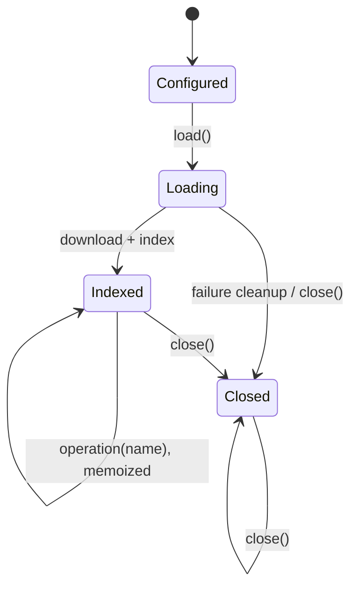

# Lazy loading

Lazy mode is an explicit low-memory contract for HTTP(S) URL sources.

## Support matrix

| Source format | JSON | YAML |
|---|---:|---:|
| OpenAPI 3.0/3.1 | Supported | Supported block layouts |
| Swagger 2.0 | Supported | Not indexed |
| Google Discovery | Supported | Not indexed |
| Caller text/object | Not applicable | Not applicable |

Unsupported formats and layouts reject. Lazy mode never silently falls back to
eager parsing.

## Usage

```ts
const parser = new MultiSpecParser({
  spec: { url: "https://example.com/openapi.json" },
  options: { lazy: true },
});

try {
  await parser.load({ signal: abortController.signal });

  console.log(parser.format);
  console.log(parser.baseUrl);
  console.log(parser.operationNames());

  const operation = await parser.getOperation("getPet");
} finally {
  await parser.close();
}
```

`parse()` is unavailable in lazy mode because it promises the complete operation
collection and would defeat the low-memory contract.

## Lifecycle



After closing, format, URL, operation-name, and operation access reject.
`close()` is idempotent.

## Disk-backed indexing

The URL response is streamed into a uniquely created temporary directory. The
loader enforces:

- HTTP(S)-only URLs
- 8 KiB URL limit
- 60-second fetch timeout
- 200 MiB response limit
- bounded response chunk count
- cancellation via `AbortSignal`
- complete-write checks
- automatic cleanup after loading failures

The index stores source byte ranges, not parsed subtrees.

### JSON index

The iterative structural scanner validates UTF-8 and JSON structure while
tracking only relevant ranges. Its explicit limits cover nesting depth, token
count, key and captured-string bytes, indexed entries, fragment bytes, and
reference traversal.

Format-specific indexes retain:

- **OpenAPI 3:** metadata, paths, operations, and component entries.
- **Swagger 2:** metadata, paths, definitions, global parameters, and responses.
- **Discovery:** metadata, nested resource/method identity, global parameters,
  and schema entries.

### OpenAPI YAML index

The line scanner supports bounded block-style OpenAPI 3 YAML. It records ranges
from indentation without parsing the complete source. Unsupported YAML features
or layouts reject rather than triggering eager parsing.

## Materialization

A request for one operation reads:

```text
metadata
+ selected path/method or Discovery method
+ path-level parameters
+ referenced global parameters/responses
+ transitive component/schema definitions
```

The resulting minimal document is sent through the same `parseSpec()` and
`compileSpecToOperations()` pipeline used by eager mode.

## Known strict boundaries

- Lazy sources must be URLs.
- Swagger and Discovery YAML are not indexed.
- Referenced OpenAPI path items are currently rejected by lazy indexers.
- Individual fragments larger than the configured fragment bound reject.
- Authentication, retries, custom transports, and caches remain caller-owned.
